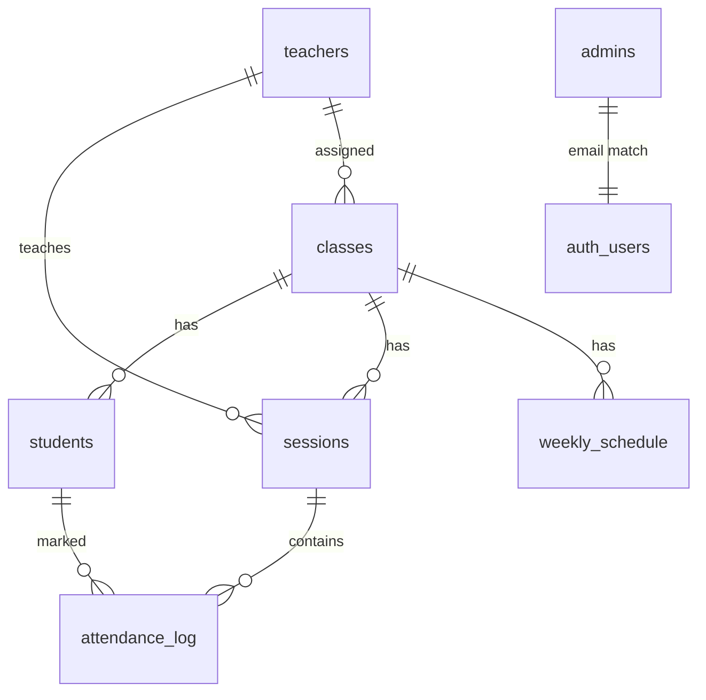

# غيابي (Ghiyabi) — التوثيق التقني

مرجع منظم لتقنيات التطبيق، المفاتيح/الأسرار، وقاعدة البيانات.  
**لا تضع قيماً سرية حقيقية في هذا الملف أو في Git** — الأسماء والمصادر فقط.

---

## 1. نظرة عامة على البنية

```
┌─────────────────────┐     ┌──────────────────────────────┐
│  Frontend (Netlify) │────▶│  Supabase                    │
│  React + Vite       │     │  • PostgreSQL + RLS          │
│  Arabic RTL         │     │  • Auth (المدير)             │
└─────────────────────┘     │  • Edge Functions            │
                            │    - notify-absent (Resend)  │
                            │    - notify-whatsapp (Meta)  │
                            └──────────────────────────────┘
```

| الطبقة | التقنية | الموقع في المستودع |
|--------|---------|---------------------|
| الواجهة | React 19, Vite, TypeScript, Tailwind CSS v4, Radix UI | `artifacts/ghiyabi/` |
| التوجيه | `react-router-dom` | `src/App.tsx` |
| الرسوم / التصدير | Recharts, ExcelJS | لوحة الإدارة |
| الخلفية (BaaS) | Supabase (PostgreSQL, Auth, Edge Functions) | `artifacts/ghiyabi/supabase/` |
| الإشعارات | Resend (بريد)، WhatsApp Cloud API (اختياري) | `supabase/functions/` |
| الاستضافة | Netlify (واجهة ثابتة) | `netlify.toml` |
| المونوريبو | pnpm workspaces | جذر المستودع |

---

## 2. تقنيات الواجهة (Frontend)

| المكوّن | الاستخدام |
|---------|-----------|
| **Vite** | بناء وتطوير الواجهة؛ المخرجات في `artifacts/ghiyabi/dist/public` |
| **React 19 + TypeScript** | واجهة المستخدم |
| **Tailwind CSS v4 + Radix** | تصميم ومكوّنات وصولية |
| **@supabase/supabase-js** | اتصال بقاعدة البيانات والمصادقة |
| **react-hot-toast** | رسائل تنبيه |
| **recharts** | رسوم بيانية في لوحة المدير |
| **exceljs** | تصدير Excel عام (ملخّص + حضور تفصيلي) |
| **Cairo (خط)** | واجهة عربية RTL |

### أوضاع الدخول

| الدور | الطريقة | التخزين |
|------|---------|---------|
| **مدير** | بريد + كلمة مرور عبر **Supabase Auth** | `auth.users` + صف في `public.admins` |
| **معلم** | رقم جوال سعودي (جلسة محلية بعد التحقق من جدول `teachers`) | `public.teachers` + حالة في الواجهة |

---

## 3. المفاتيح والمتغيرات البيئية

### 3.1 واجهة الويب (عامة نسبياً — تُحقن وقت البناء)

ملف محلي: `artifacts/ghiyabi/.env` (من `.env.example`)  
على Netlify: **Site settings → Environment variables**

| المتغير | سري؟ | المصدر | ملاحظات |
|---------|------|--------|---------|
| `VITE_SUPABASE_URL` | لا | Supabase → Settings → API → Project URL | يظهر في حزمة الواجهة |
| `VITE_SUPABASE_ANON_KEY` | شبه عام | Settings → API → `anon` / publishable | محمي بـ RLS؛ لا يمنح صلاحيات المدير |

```bash
cp artifacts/ghiyabi/.env.example artifacts/ghiyabi/.env
# ثم املأ القيم من لوحة Supabase
```

### 3.2 أسرار Edge Functions (خاصة — لا تُضاف إلى `.env` الأمامي)

تُضبط في: **Supabase → Project Settings → Edge Functions → Secrets**  
أو: `supabase secrets set KEY=value`

#### مشتركة

| السر | الغرض |
|------|--------|
| `SUPABASE_URL` | عنوان المشروع (غالباً يُوفَّر تلقائياً في بيئة الدوال) |
| `SUPABASE_SERVICE_ROLE_KEY` | تجاوز RLS لجلب بيانات الطلاب/الجلسات داخل الدالة — **لا تعرضه أبداً للواجهة** |
| `NOTIFY_WEBHOOK_SECRET` | اختياري؛ إن وُجد يجب أن يرسل الـ Webhook ترويسة `Authorization: Bearer <القيمة>` |

#### `notify-absent` (بريد الغياب)

| السر | الغرض |
|------|--------|
| `RESEND_API_KEY` | إرسال بريد عبر [Resend](https://resend.com) |

#### `notify-whatsapp` (واتساب)

| السر | الغرض |
|------|--------|
| `WHATSAPP_ACCESS_TOKEN` | رمز Meta Cloud API |
| `WHATSAPP_PHONE_NUMBER_ID` | معرّف رقم الإرسال |
| `WHATSAPP_GRAPH_API_VERSION` | اختياري (افتراضي `v21.0`) |

### 3.3 ما لا يُخزَّن في المستودع

| العنصر | أين يُدار |
|--------|-----------|
| كلمات مرور المديرين | Supabase Auth فقط |
| `SERVICE_ROLE` / Resend / WhatsApp | أسرار Edge Functions فقط |
| ملفات `.env` | مُدرجة في `.gitignore` |

### 3.4 حسابات اختبار (بيئة تطوير فقط)

| الدور | المعرّف | كلمة المرور | ملاحظة |
|------|---------|-------------|--------|
| مدير | `admin@school.test` | تُضبط في Auth (مثال E2E: `TestPass123!`) | يجب وجود نفس البريد في `admins` |
| معلم | رقم في جدول `teachers` مع `is_active = true` | لا كلمة مرور Auth | تسجيل بالجوال من شاشة الدخول |

> غيّر كلمات المرور فوراً في الإنتاج.

---

## 4. قاعدة البيانات (PostgreSQL عبر Supabase)

**الملفات المرجعية**

| الملف | الدور |
|-------|------|
| [`artifacts/ghiyabi/supabase/schema.sql`](artifacts/ghiyabi/supabase/schema.sql) | الجداول + RLS + الفهارس |
| [`artifacts/ghiyabi/supabase/seed.sql`](artifacts/ghiyabi/supabase/seed.sql) | بيانات أولية (فصول / طلاب / معلمون) |

**التطبيق:** Supabase → SQL Editor → نفّذ `schema.sql` ثم `seed.sql`.

### 4.1 مخطط الجداول



#### `classes` — الفصول

| العمود | النوع | الوصف |
|--------|------|--------|
| `id` | UUID PK | معرّف الفصل |
| `name` | TEXT | مثل `3-A` |
| `grade_level` | TEXT | مثل `Grade 3` |
| `teacher_phone` | TEXT | جوال المعلم المسؤول (اختياري) |

#### `students` — الطلاب

| العمود | النوع | الوصف |
|--------|------|--------|
| `id` | UUID PK | |
| `full_name` | TEXT | الاسم الكامل |
| `class_id` | UUID FK → classes | |
| `parent_email` | TEXT | لإشعارات البريد |
| `parent_phone` | TEXT | لإشعارات واتساب |
| `is_active` | BOOLEAN | افتراضي `true` |

#### `sessions` — الحصص اليومية

| العمود | النوع | الوصف |
|--------|------|--------|
| `id` | UUID PK | |
| `date` | DATE | تاريخ الحصة |
| `period` | TEXT | `P1` … `P6` |
| `subject` | TEXT | المادة |
| `class_id` | UUID FK → classes | |
| `teacher_phone` | TEXT NOT NULL | المعلم المعني بالحضور |

#### `attendance_log` — سجل الحضور

| العمود | النوع | الوصف |
|--------|------|--------|
| `id` | UUID PK | |
| `student_id` | UUID FK → students | |
| `session_id` | UUID FK → sessions | |
| `status` | TEXT | `Present` / `Absent` / `Late` / `Excused` |
| `marked_at` | TIMESTAMPTZ | وقت التسجيل |
| `note` | TEXT | ملاحظة اختيارية |
| | UNIQUE(`student_id`,`session_id`) | منع التكرار |

#### `admins` — المديرون

| العمود | النوع | الوصف |
|--------|------|--------|
| `email` | TEXT PK | يجب أن يطابق `auth.users.email` |

كلمة المرور **ليست** في هذا الجدول — فقط في Supabase Auth.

#### `teachers` — المعلمون

| العمود | النوع | الوصف |
|--------|------|--------|
| `phone` | TEXT PK | رقم الجوال (مفتاح الدخول) |
| `name` | TEXT | الاسم |
| `is_active` | BOOLEAN | إن `false` يُرفض الدخول |

#### `weekly_schedule` — قالب الجدول الأسبوعي

| العمود | النوع | الوصف |
|--------|------|--------|
| `id` | UUID PK | |
| `day_of_week` | SMALLINT | 0=أحد … 6=سبت |
| `period` | TEXT | `P1`…`P6` |
| `subject` | TEXT | |
| `class_id` | UUID FK | |
| `teacher_phone` | TEXT | |
| `created_at` | TIMESTAMPTZ | |

يُستخدم لتوليد حصص أسبوع من لوحة الإدارة (`/admin/schedule`).

### 4.2 الأمان (RLS)

- جميع الجداول أعلاه عليها **Row Level Security**.
- الدالة المساعدة `is_admin()` تتحقق من وجود `auth.email()` في `admins`.
- المديرون: صلاحيات كاملة عبر سياسات `admins_all_*`.
- المعلمون / الجلسات غير الإدارية: سياسات قراءة (وكتابة للحضور حيث ينطبق) عبر سياسات `public_*` حسب التصميم الحالي.

### 4.3 الفهارس الرئيسية

- `students(class_id)`, `students(is_active)`
- `sessions(date)`, `sessions(teacher_phone)`, `sessions(class_id)`
- `attendance_log(session_id)`, `attendance_log(student_id)`, `attendance_log(status)`
- `weekly_schedule(day_of_week)`, `weekly_schedule(teacher_phone)`, `weekly_schedule(class_id)`

### 4.4 Auth مقابل الجداول العامة

| المخزن | المحتوى |
|--------|---------|
| `auth.users` (Supabase) | حسابات المدير (بريد + كلمة مرور مشفّرة) |
| `public.admins` | قائمة البريد المسموح لها بدور مدير |
| `public.teachers` | أرقام جوال المعلمين المصرّح لهم |

---

## 5. المسارات والصفحات

| المسار | الدور | الوظيفة |
|--------|------|---------|
| `/login` | الجميع | دخول معلم (جوال) أو مدير (بريد) |
| `/teacher` | معلم | حصص اليوم |
| `/teacher/session/:id` | معلم | تسجيل الحضور |
| `/admin` | مدير | مؤشرات + رسوم + تصدير Excel |
| `/admin/teachers` | مدير | إدارة المعلمين |
| `/admin/students` | مدير | الطلاب |
| `/admin/classes` | مدير | الفصول |
| `/admin/sessions` | مدير | الحصص |
| `/admin/schedule` | مدير | الجدول الأسبوعي |
| `/admin/account` | مدير | حساب المدير |

---

## 6. النشر (ملخص)

| الخدمة | الإعداد |
|--------|---------|
| **Netlify** | `netlify.toml`: بناء `pnpm --filter @workspace/ghiyabi run build`، نشر `artifacts/ghiyabi/dist/public` |
| **متغيرات Netlify** | `VITE_SUPABASE_URL`, `VITE_SUPABASE_ANON_KEY` |
| **Supabase URL Config** | Site URL + Redirect URLs = عنوان Netlify |
| **Webhooks** | على `attendance_log` → استدعاء `notify-absent` / `notify-whatsapp` |

التفاصيل التشغيلية: [`DEPLOYMENT.md`](../DEPLOYMENT.md).

---

## 7. أوامر سريعة

```bash
# تثبيت
pnpm install

# تطوير
pnpm --filter @workspace/ghiyabi dev

# بناء
pnpm --filter @workspace/ghiyabi run build

# نشر (يتطلب Netlify CLI ومصادقة)
pnpm run deploy:production
```

---

## 8. قائمة تحقق أمنية

- [ ] لا يوجد `SERVICE_ROLE` أو `RESEND_*` أو توكن واتساب في الواجهة أو في Git
- [ ] RLS مفعّل على كل الجداول العامة
- [ ] بريد المدير في `admins` يطابق مستخدم Auth
- [ ] المعلمون غير النشطين (`is_active = false`) لا يدخلون
- [ ] كلمات مرور الإنتاج قوية وليست قيم الاختبار
- [ ] عناوين Redirect في Auth تطابق نطاق Netlify

---

*آخر تحديث للهيكل وفق `schema.sql` وواجهة `artifacts/ghiyabi`.*
